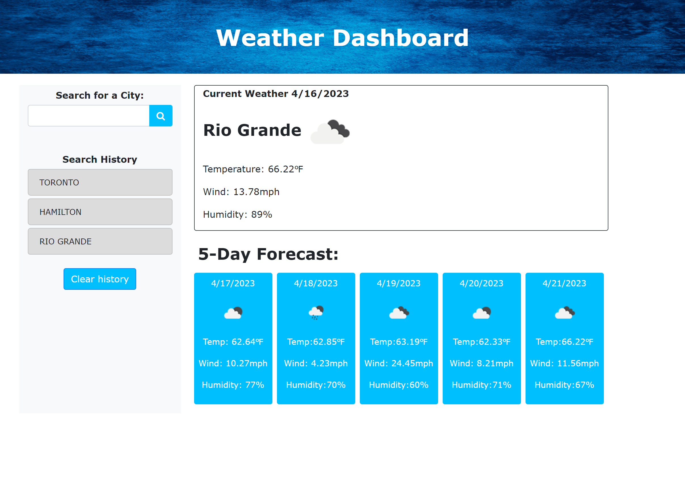

# Weather-Dashboard

## Description

A weather dashboard using a server side API retrieved from the Open Weather API. Searching for an specific city the user will get the temperature, wind speed and Humidity.
Also,for the city searched the user will have a 5 day forecast, which will give the temperature, Wind and humidity for the next 5 days.


It contains notes on HTML, CSS.

## Acceptance criteria

```
GIVEN a weather dashboard with form inputs
WHEN I search for a city
THEN I am presented with current and future conditions for that city and that city is added to the search history
WHEN I view current weather conditions for that city
THEN I am presented with the city name, the date, an icon representation of weather conditions, the temperature, the humidity, and the the wind speed
WHEN I view future weather conditions for that city
THEN I am presented with a 5-day forecast that displays the date, an icon representation of weather conditions, the temperature, the wind speed, and the humidity
WHEN I click on a city in the search history
THEN I am again presented with current and future conditions for that city
```


## Live URL




 https://renansm93.github.io/Weather-Dashboard/

https://github.com/renansm93/Weather-Dashboard

## Contributors


> * renansm93
>>
> * https://www.w3schools.com/js/
>
> * https://developer.mozilla.org/en-US/docs/Web/JavaScript

> * https://developer.mozilla.org/en-US/docs/Learn/JavaScript/Client-side_web_APIs/Introduction

> * https://getbootstrap.com/docs/5.3/getting-started/introduction/

> * https://openweathermap.org/forecast5


